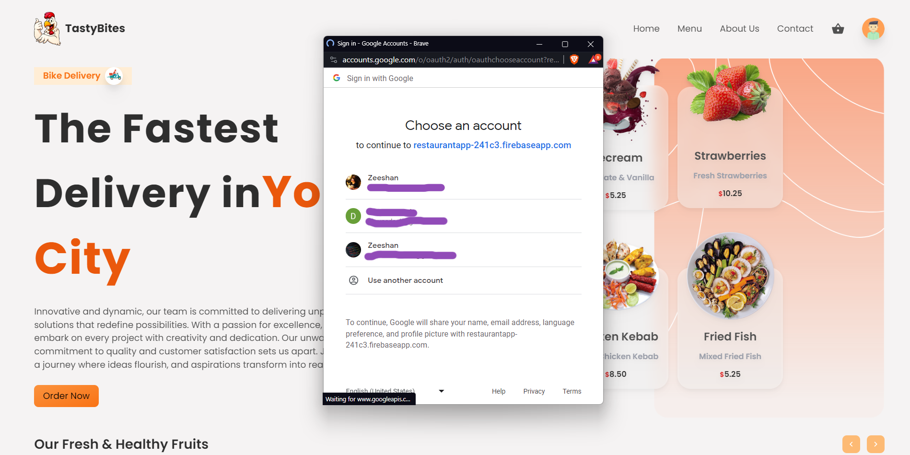
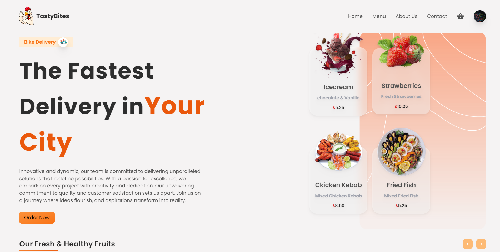
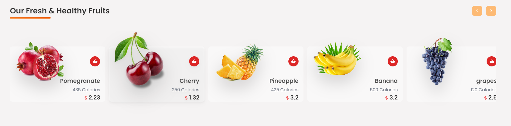
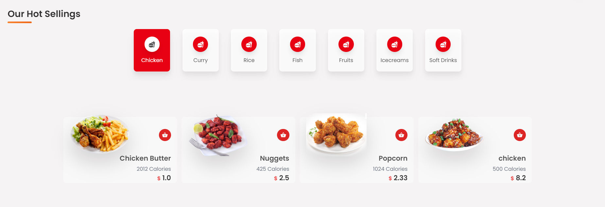
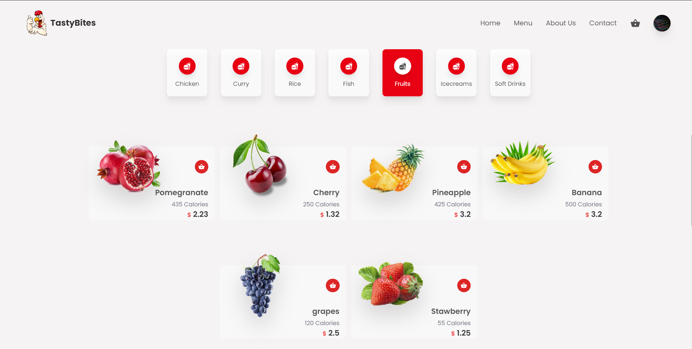
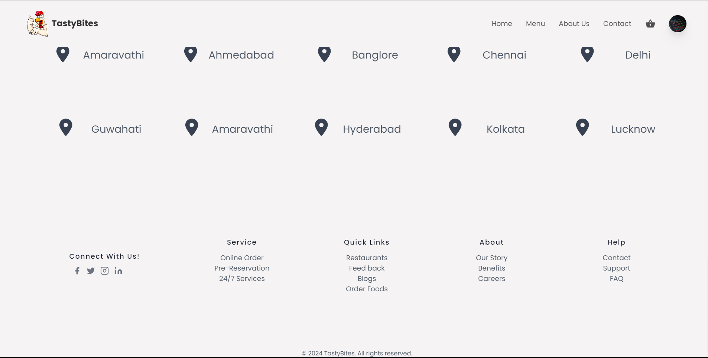
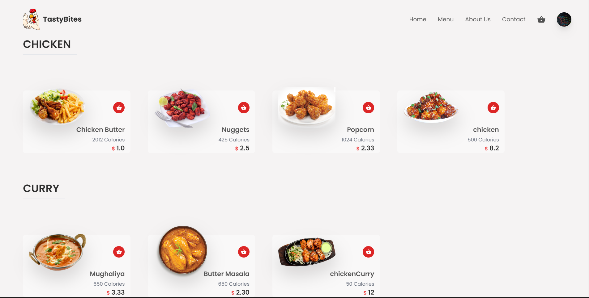
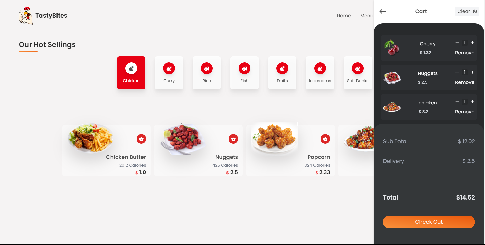
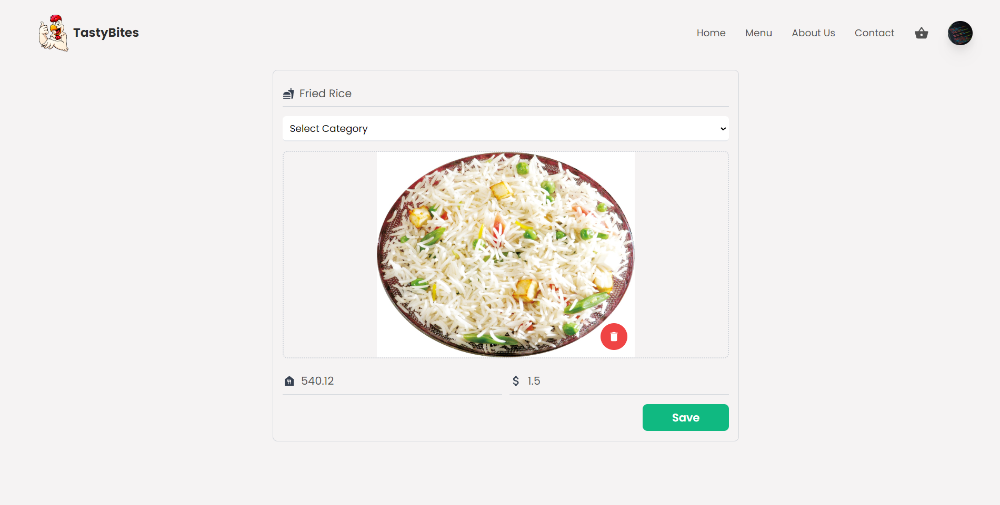

# Used Tech Stack
1. React (redux)
2. Tailwind
3. Firebase

# Screenshots of the UI

# Google Login/SignUp

# First Look

# Fruit section

# Foods with different Category

# Footer

# Menu Page

# Add to cart and Check Out

# Add product as an admin

steps to initialize and run the project : 
1. in the command terminal, go to client -> cd client.
2. in the command terminal, go to server -> cd server->cd functions-> then npm i to install all the necessary things 
3. in the client -> npm i, to start the front-end . 
4. All the firebase keys required for running are provided in the .env file . 

By, 
Anand Kumar Singh
